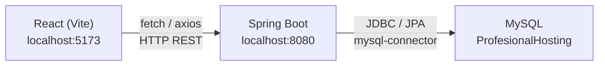

# Integración React (Frontend) ↔ Spring Boot (Backend) ↔ MySQL (ProfesionalHosting)

Conectar el proyecto React (`tfg_adventure`) con el proyecto Spring Boot (`ob-spring-security-jwt-roles`) como backend API, y que este se conecte a la base de datos MySQL alojada en ProfesionalHosting (phpMyAdmin).

## Arquitectura



## User Review Required

> [!IMPORTANT]
> Necesito que me proporciones los **datos de conexión** de tu base de datos MySQL en ProfesionalHosting:
> 1. **Host** del servidor MySQL (ej: `mysql-XXX.profesionalhosting.com` o la IP)
> 2. **Puerto** (normalmente `3306`)
> 3. **Nombre de la base de datos**
> 4. **Usuario** de la base de datos
> 5. **Contraseña** de la base de datos

> [!WARNING]
> ProfesionalHosting puede tener **restricciones de acceso remoto** a MySQL. Deberás asegurarte de que tu IP (o todas las IPs) estén permitidas en la configuración del hosting. Normalmente se hace desde el panel de control → "Acceso remoto MySQL".

---

## Cambios Propuestos

Los cambios se organizan en **3 bloques**: Spring Boot (backend), React (frontend), y configuración del hosting.

---

### Bloque 1 — Spring Boot: Conexión a MySQL remoto

#### [MODIFY] [pom.xml](file:///Users/david/workspace/Qualica-rd/ob-spring-security-jwt-roles/pom.xml)

- **Añadir** la dependencia del conector MySQL:
```xml
<dependency>
    <groupId>com.mysql</groupId>
    <artifactId>mysql-connector-j</artifactId>
    <scope>runtime</scope>
</dependency>
```
- **Eliminar** la dependencia de H2 (o dejarla solo para tests)

#### [MODIFY] [application.properties](file:///Users/david/workspace/Qualica-rd/ob-spring-security-jwt-roles/src/main/resources/application.properties)

- Reemplazar la configuración H2 por MySQL:
```properties
# MySQL - ProfesionalHosting
spring.datasource.url=jdbc:mysql://<HOST>:<PUERTO>/<NOMBRE_BD>?useSSL=true&serverTimezone=Europe/Madrid
spring.datasource.username=<USUARIO>
spring.datasource.password=<CONTRASEÑA>
spring.datasource.driver-class-name=com.mysql.cj.jdbc.Driver

# JPA
spring.jpa.database-platform=org.hibernate.dialect.MySQLDialect
spring.jpa.hibernate.ddl-auto=update
spring.jpa.show-sql=true
```

#### [MODIFY] [WebSecurityConfig.java](file:///Users/david/workspace/Qualica-rd/ob-spring-security-jwt-roles/src/main/java/com/example/ob_spring_security_jwt_roles/config/WebSecurityConfig.java)

- Configurar CORS correctamente para permitir peticiones desde `http://localhost:5173` (Vite dev) en lugar de deshabilitarlo:
```java
.cors(cors -> cors.configurationSource(corsConfigurationSource()))
```
- Añadir el bean `CorsConfigurationSource` con los orígenes permitidos

#### [MODIFY] [CORSFilter.java](file:///Users/david/workspace/Qualica-rd/ob-spring-security-jwt-roles/src/main/java/com/example/ob_spring_security_jwt_roles/config/CORSFilter.java)

- Actualizar o eliminar este filtro manual en favor de la configuración CORS integrada de Spring Security (para evitar conflictos con la configuración de [WebSecurityConfig](file:///Users/david/workspace/Qualica-rd/ob-spring-security-jwt-roles/src/main/java/com/example/ob_spring_security_jwt_roles/config/WebSecurityConfig.java#15-64))

---

### Bloque 2 — React: Servicio API y conexión al backend

#### [NEW] [api.ts](file:///Users/david/workspace/TFG_DAW/tfg_adventure/src/services/api.ts)

- Crear un servicio base con `fetch` o `axios` que apunte a `http://localhost:8080`
- Incluir interceptores para adjuntar el token JWT en las cabeceras `Authorization: Bearer <token>`
- Funciones helper para GET, POST, PUT, DELETE

#### [NEW] [authService.ts](file:///Users/david/workspace/TFG_DAW/tfg_adventure/src/services/authService.ts)

- Funciones `login(username, password)` y `register(user)` que llamen a `/users/authenticate` y `/users/register`
- Almacenar el token JWT en `localStorage`
- Función `logout()` para limpiar el token

#### [MODIFY] [vite.config.ts](file:///Users/david/workspace/TFG_DAW/tfg_adventure/vite.config.ts)

- Añadir un **proxy** para redirigir las peticiones `/api` al backend Spring Boot en desarrollo:
```typescript
server: {
  proxy: {
    '/api': {
      target: 'http://localhost:8080',
      changeOrigin: true,
      rewrite: (path) => path.replace(/^\/api/, '')
    }
  }
}
```

---

### Bloque 3 — Configuración en ProfesionalHosting

Este bloque es **manual** y lo debe hacer el usuario desde el panel de control:

1. **Habilitar acceso remoto MySQL**: Panel de control → Bases de datos → Acceso remoto → Añadir tu IP pública (o `%` para todas)
2. **Verificar credenciales**: Entrar a phpMyAdmin y confirmar que el usuario y contraseña funcionan
3. **Anotar el host exacto**: Normalmente aparece en el panel como algo tipo `mysql-XXX.profesionalhosting.com`

---

## Resumen de Flujo Completo

| Paso | Acción | Resultado |
|------|--------|-----------|
| 1 | React hace `POST /api/users/authenticate` | Vite proxy → Spring Boot |
| 2 | Spring Boot valida credenciales contra MySQL | Consulta JPA a MySQL remoto |
| 3 | Spring Boot devuelve JWT | Token almacenado en `localStorage` |
| 4 | React hace peticiones con `Authorization: Bearer <token>` | Acceso a endpoints protegidos |
| 5 | Spring Boot ejecuta queries | CRUD sobre MySQL en ProfesionalHosting |

---

## Plan de Verificación

### Test 1: Conexión MySQL (Spring Boot)
1. Ejecutar el proyecto Spring Boot: `./mvnw spring-boot:run` desde el directorio del proyecto
2. Verificar en los logs que no hay errores de conexión a MySQL
3. Si hay error de acceso remoto → revisar configuración en ProfesionalHosting

### Test 2: API REST (Navegador/Postman)
1. Con Spring Boot corriendo, hacer `POST http://localhost:8080/users/register` con un JSON de usuario
2. Hacer `POST http://localhost:8080/users/authenticate` con las credenciales
3. Verificar que se recibe un token JWT

### Test 3: Conexión React → Spring Boot
1. Ejecutar React: `npm run dev` desde `tfg_adventure`
2. Usar los servicios de `authService.ts` para hacer login desde la interfaz
3. Verificar en la consola del navegador que se recibe el token

### Verificación Manual (Usuario)
1. Abrir phpMyAdmin en ProfesionalHosting
2. Verificar que las tablas `ob_user` y `USER_ROLES` se han creado automáticamente (gracias a `ddl-auto=update`)
3. Verificar que los registros de usuarios aparecen en la tabla
